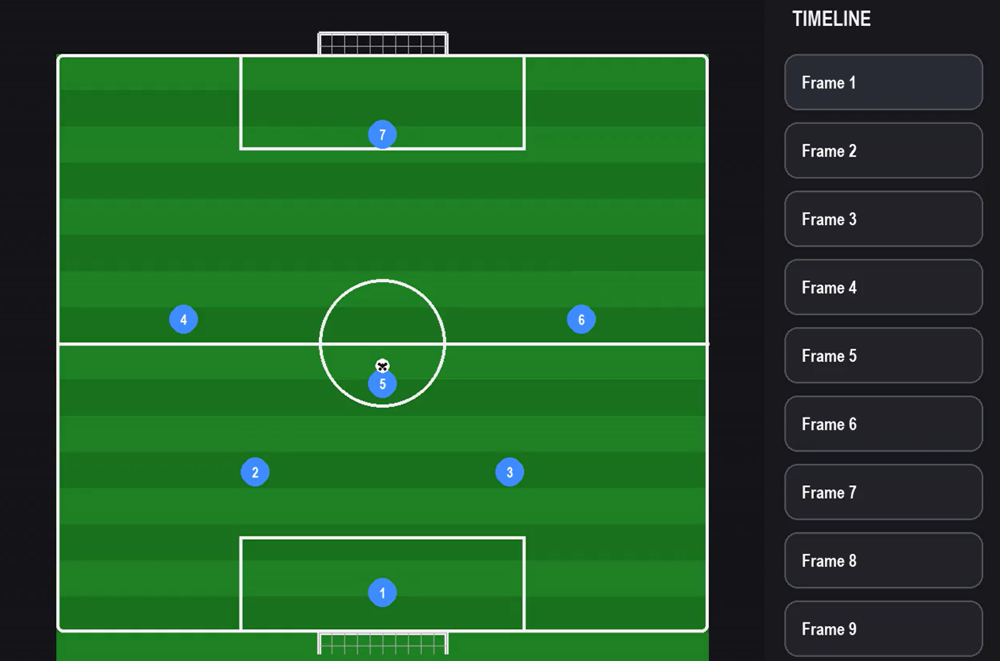
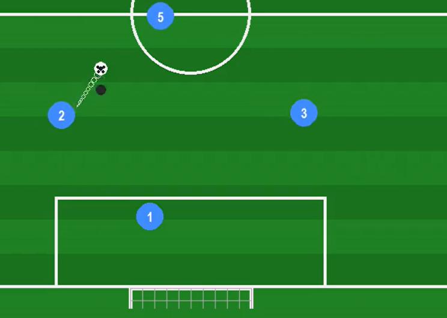
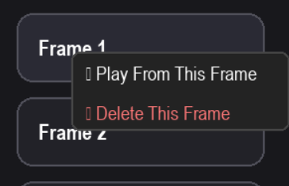

# Football Tactical Animation Studio

A cinematic football tactical animation editor built with Python and Pygame.

## Features

- Tactical frame-by-frame sequencing
- Cinematic player interpolation
- Lofted ball animations
- Motion trails
- Goal net wobble
- MP4 export system
- Timeline-based editing
- Realistic football choreography

## Controls

| Key | Action |
|---|---|
| 1-7 | Select player |
| N | Create new frame |
| SPACE | Play animation |
| L | Toggle lofted pass mode |
| E | Export MP4 video |
| Right Click Frame | Context menu |

## Tech Stack

- Python
- Pygame
- ImageIO
- NumPy

## Demo

## Screenshots

### Tactical Setup

---

### Lofted Pass Animation

---

### Timeline Editor

---

### Working Demo

## Future Improvements

- Save/load projects
- Better net physics
- Curved lofted passes
- UI polish
